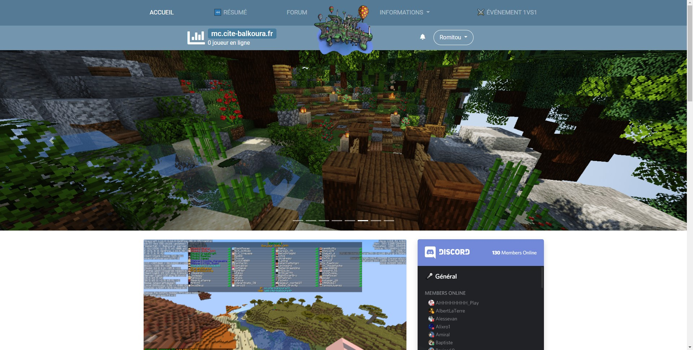

  
<h2 align="center">🎨 BalkouraAzuriom 🎨</h2>  

Azuriom theme used on the Cité of Balkoura website.
  

   

## 🚀 Download and installation
You can download BalkouraAzuriom by [downloading the repository](https://github.com/Cite-Balkoura/BalkouraAzuriom/archive/main.zip).  
Then, you can unzip and drag it into your `/resources/themes` folder.

## 📷 Screenshots

